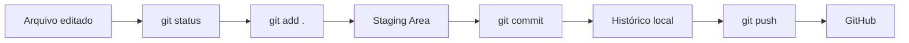
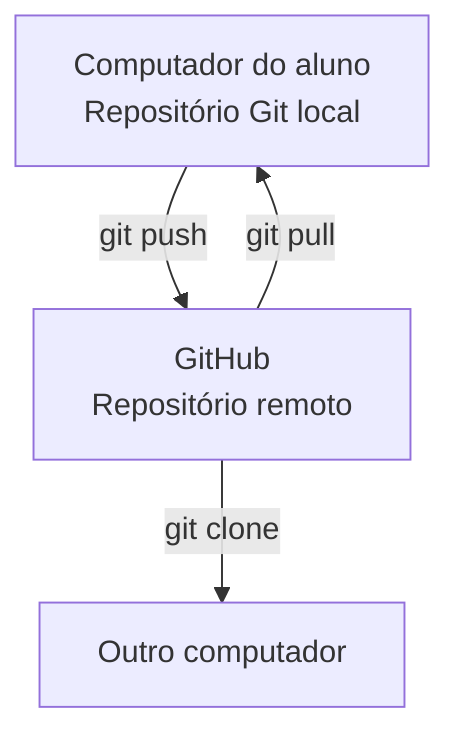
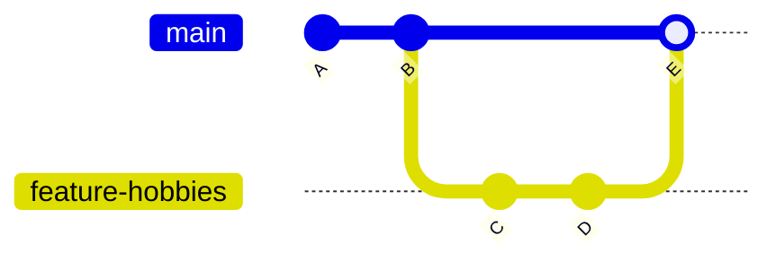

# Curso Rápido de Git e GitHub — 5 Aulas Práticas

Material fonte para ensinar Git e GitHub para iniciantes em 5 encontros de 1h.

## Objetivo

Capacitar iniciantes a utilizar Git e GitHub para versionar projetos, publicar código e colaborar de forma básica.

---

## Visão Geral das Aulas

| Aula | Tema | Resultado esperado |
|---|---|---|
| 1 | Primeiros passos com Git | Git configurado e primeiro repositório local |
| 2 | Commits e histórico | Commits pequenos e histórico consultado |
| 3 | GitHub na prática | Projeto publicado no GitHub |
| 4 | Branches | Funcionalidade criada em branch separada |
| 5 | Merge e projeto final | Mini portfólio publicado |

---

## Diagrama 1 — Fluxo básico do Git



## Diagrama 2 — Git local e GitHub remoto



## Diagrama 3 — Branch e merge



---

# Aula 1 — Primeiros Passos com Git

## Objetivos

- Entender o que é Git
- Instalar Git
- Configurar usuário
- Criar primeiro repositório

## Roteiro de 1h

| Tempo | Atividade |
|---|---|
| 0–10 min | Explicar Git como controle de versões |
| 10–25 min | Verificar instalação e configurar usuário |
| 25–45 min | Criar repositório local com `git init` |
| 45–60 min | Criar README.md e usar `git status` |

## Comandos

```bash
git --version

git config --global user.name "Seu Nome"
git config --global user.email "email@gmail.com"

mkdir meu-primeiro-projeto
cd meu-primeiro-projeto
git init
git status
```

## Prática

Criar `README.md` com o conteúdo:

```markdown
# Meu Primeiro Projeto
```

## Tarefa

Criar um repositório local chamado `apresentacao-pessoal`.

---

# Aula 2 — Commits e Histórico

## Objetivos

- Salvar alterações
- Entender o ciclo do Git
- Consultar o histórico do projeto

## Roteiro de 1h

| Tempo | Atividade |
|---|---|
| 0–10 min | Revisar `git init` e `git status` |
| 10–25 min | Explicar working tree, staging area e commit |
| 25–45 min | Criar `sobre-mim.txt` e realizar commit |
| 45–60 min | Criar três commits pequenos e consultar histórico |

## Comandos

```bash
git status

git add .

git commit -m "feat: cria README"

git log --oneline
```

## Prática

Criar o arquivo:

```text
sobre-mim.txt
```

Adicionar informações pessoais e realizar commit.

## Tarefa

Criar três commits diferentes:

```text
feat: adiciona nome
feat: adiciona curso
feat: adiciona contato
```

---

# Aula 3 — GitHub na Prática

## Objetivos

- Criar repositório remoto
- Conectar o projeto local ao GitHub
- Enviar o projeto para a nuvem

## Roteiro de 1h

| Tempo | Atividade |
|---|---|
| 0–10 min | Explicar Git local x GitHub remoto |
| 10–30 min | Criar repositório no GitHub |
| 30–50 min | Conectar remote e executar push |
| 50–60 min | Conferir projeto publicado no navegador |

## Comandos

```bash
git remote add origin URL_DO_REPOSITORIO

git remote -v

git push -u origin master
# ou
git push -u origin main
```

## Tarefa

Compartilhar o link do repositório com a turma.

---

# Aula 4 — Branches

## Objetivos

- Criar branches
- Trabalhar em funcionalidades separadas
- Evitar mexer diretamente na versão principal

## Roteiro de 1h

| Tempo | Atividade |
|---|---|
| 0–10 min | Explicar branch principal como versão estável |
| 10–25 min | Criar e trocar de branch |
| 25–45 min | Criar arquivo `hobbies.txt` em branch separada |
| 45–60 min | Cada aluno cria uma branch própria |

## Comandos

```bash
git checkout -b feature-hobbies

git branch

git checkout master
# ou
git checkout main
```

## Tarefa

Cada aluno deve criar uma branch própria com uma funcionalidade diferente.

---

# Aula 5 — Merge e Projeto Final

## Objetivos

- Juntar alterações
- Simular trabalho em equipe
- Publicar projeto final no GitHub

## Roteiro de 1h

| Tempo | Atividade |
|---|---|
| 0–15 min | Explicar merge como união de funcionalidade pronta |
| 15–35 min | Executar merge na prática |
| 35–55 min | Criar mini portfólio |
| 55–60 min | Conferir projeto no GitHub |

## Comandos

```bash
git checkout master
# ou
git checkout main

git merge feature-hobbies

git push
```

## Projeto Final

```text
portfolio
│
├── README.md
├── sobre-mim.txt
├── habilidades.txt
├── hobbies.txt
└── contato.txt
```

## Fluxo obrigatório

```bash
git init

git add .

git commit -m "feat: projeto inicial"

git remote add origin URL

git push

git checkout -b feature-habilidades

git add .

git commit -m "feat: adiciona habilidades"

git checkout master
# ou git checkout main

git merge feature-habilidades

git push
```

---

# Comandos Essenciais

```bash
git init
git status
git add .
git commit -m "mensagem"
git log --oneline
git branch
git checkout -b nova-branch
git merge nome-da-branch
git remote add origin URL
git push
git pull
git clone URL
```
